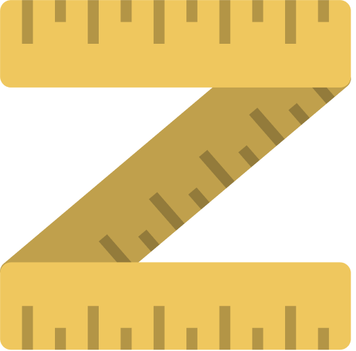

  

# Calindra-ft2

 

## About

  This project's only purpose is to respond to the challenge made by Calindra through an interview process. The application is a SPA with its layout provided by a <a href="https://www.figma.com/file/GTEyrXtVtgSDeiocLk7KzCFf/layouttesteavaliacao">figma</a> file.

  

  <a href="#features">Features</a> •
  <a href="#stack">Stack</a> •
  <a href="#deploy">Deploy</a> •
  <a href="#authors">Authors</a>

 

### Features
- Header:
- [x] Site logo 
- [x] Menu options  
- Main Page:
- [x] Presentation 
- [x] Business info  
- Footer:
- [x] Social media 
- [x] Contact info

  

### Stack
Languages: 

  
  
  
  

 

The following tools and frameworks were used in the construction of the project: 

  
  
  
  
  
  
  
  

 

Version Control: 

  
  

  

### Deploy

The application is available on VercelApp: [Calindra-ft2](https://calindra-ft2-r51q9jewi-klaussvp.vercel.app/)

  
## Contributors
<table>
  <tr>
    <td align="center" style="margin-right: 20px;"><a href="https://github.com/vercel"> <b>Vercel</b></a> 
  </tr>
</table>

  

### Authors
---
  |   Klauss Correa | 👋 Get in Touch!     |
  |-----------|-----------|
